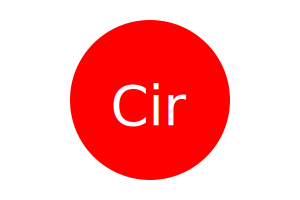
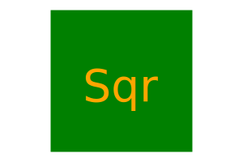
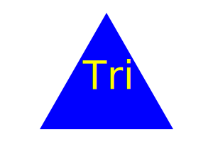

### SVG Generator

The SVG Generator is a command-line application that allows users to create SVG images by specifying the shape, color, text, and text color. Users can choose from three shapes: Circle, Square, and Triangle, and customize their appearance using color keywords or hexadecimal values.

#### Features

- Create SVG images with customizable shapes, colors, and text.
- Choose from three different shapes: Circle, Square, and Triangle.
- Specify the color of the shape and the text using color keywords or hexadecimal values.
- Easily generate SVG images directly from the command line.

#### Installation

To install the SVG Generator, follow these steps:

1. Clone the repository to your local machine.
2. Navigate to the project directory.
3. Run `npm install` to install the necessary dependencies.

#### Usage

To use the SVG Generator, follow these steps:

1. Open your terminal or command prompt.
2. Navigate to the project directory.
3. Run `node index.js` to start the application.
4. Follow the prompts to select the shape, color, text, and text color for your SVG image.
5. Once you have entered all the required information, the SVG file will be generated in the `examples` directory.

#### Examples

Here are some examples of SVG images generated using the SVG Generator:

- Circle:
  

- Square:
  

- Triangle:
  

#### Contributing

Contributions to the SVG Generator are welcome! If you encounter any bugs or have suggestions for improvements, please open an issue or submit a pull request on GitHub.

#### License

This project is licensed under the MIT License. See the [LICENSE](./LICENSE) file for details.

#### Author

The SVG Generator was created by Win Pomerantz.
